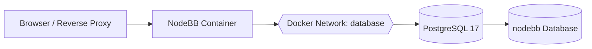

<div align="center">

# 💬 NodeBB + PostgreSQL 17 — Docker Compose

**Run NodeBB using the shared PostgreSQL 17 container instead of a separate MongoDB container.**


</div>

---

## 📋 Table of Contents

- [Overview](#-overview)
- [Architecture](#-architecture)
- [Files](#-files)
- [Prerequisites](#-prerequisites)
- [1. Verify PostgreSQL](#1-verify-postgresql)
- [2. Create the NodeBB Database and User](#2-create-the-nodebb-database-and-user)
- [3. Create the NodeBB `.env` File](#3-create-the-nodebb-env-file)
- [4. Generate a 64-Character Password](#4-generate-a-64-character-password)
- [5. Edit `.env` with Nano](#5-edit-env-with-nano)
- [6. Secure `.env`](#6-secure-env)
- [7. Verify `.gitignore`](#7-verify-gitignore)
- [8. Start NodeBB](#8-start-nodebb)
- [9. Complete the NodeBB Setup](#9-complete-the-nodebb-setup)
- [10. Verify the Deployment](#10-verify-the-deployment)
- [Security Notes](#-security-notes)
- [Management Commands](#-management-commands)

---

## 🔎 Overview

This Compose project runs **NodeBB** while using the existing **PostgreSQL 17** Docker container as its primary database.

The PostgreSQL service is expected to already be running with:

```text
Container: postgresql
Hostname:  postgresql
Port:      5432
Network:   database
```

NodeBB does **not** start its own MongoDB or PostgreSQL container.

> [!IMPORTANT]
> Give NodeBB its own PostgreSQL database and login role. Do not use the PostgreSQL administrator account as the NodeBB application account.

---

## 🧱 Architecture



The PostgreSQL port does not need to be published to the host merely for NodeBB to use it. Docker resolves the hostname `postgresql` over the shared `database` network.

---

## 📁 Files

```text
NodeBB/
├── docker-compose.yaml
├── example-.env
├── example-postgresql.env
├── create-nodebb-database.sql
├── .gitignore
└── README.md
```

The real `.env` file is created locally and is intentionally ignored by Git.

---

## ✅ Prerequisites

The Docker host should already have:

- Docker Engine
- Docker Compose
- Git
- Nano
- Python 3
- The shared PostgreSQL 17 container running

Verify:

```bash
docker --version
docker compose version
git --version
python3 --version
```

---

# 1. Verify PostgreSQL

Check that the shared PostgreSQL container is running:

```bash
docker ps --filter name=postgresql
```

Check readiness:

```bash
docker exec postgresql pg_isready
```

Verify that the shared Docker network exists:

```bash
docker network inspect database
```

If the PostgreSQL project has not been started yet, start it from its own directory:

```bash
docker compose up -d
```

---

# 2. Create the NodeBB Database and User

NodeBB requires a PostgreSQL login role and database before setup.

## Recommended interactive method

Open PostgreSQL using the administrator account:

```bash
docker exec -it postgresql psql -U postgres_admin -d postgres
```

Create the NodeBB login role:

```sql
CREATE ROLE nodebb WITH LOGIN;
```

Set its password without putting the password directly into shell history:

```text
\password nodebb
```

PostgreSQL will prompt you to enter the password twice.

Create the NodeBB database and make the `nodebb` role its owner:

```sql
CREATE DATABASE nodebb OWNER nodebb;
```

Apply basic role restrictions:

```sql
ALTER ROLE nodebb NOCREATEDB NOCREATEROLE NOSUPERUSER;
```

Exit:

```text
\q
```

> [!NOTE]
> `create-nodebb-database.sql` is also included as a template. The interactive `\password` method is preferable because it avoids placing the real database password directly in an SQL file.

Verify the database:

```bash
docker exec -it postgresql psql -U postgres_admin -d postgres -c '\l'
```

Verify the role:

```bash
docker exec -it postgresql psql -U postgres_admin -d postgres -c '\du'
```

---

# 3. Create the NodeBB `.env` File

Copy the example:

```bash
cp example-.env .env
```

The file contains:

```dotenv
NODEBB_HOST_PORT=4567

NODEBB_PROTOCOL=https
NODEBB_DOMAIN=forum.example.com

NODEBB_DB_HOST=postgresql
NODEBB_DB_PORT=5432
NODEBB_DB_NAME=nodebb
NODEBB_DB_USER=nodebb
NODEBB_DB_PASSWORD=CHANGE_ME_TO_A_LONG_RANDOM_PASSWORD
NODEBB_DB_SSL=false

POSTGRES_NETWORK_NAME=database
NODEBB_VOLUME_NAME=nodebb_data

TZ=America/Los_Angeles
```

The `NODEBB_DB_*` values are kept here so you have one protected local reference while completing NodeBB's setup. NodeBB's supported setup flow writes the actual database configuration to its `config.json`.

---

# 4. Generate a 64-Character Password

Generate a cryptographically random password:

```bash
python3 -c 'import secrets,string; chars=string.ascii_letters+string.digits+"!%+,-./:=?@[]^_{|}~"; print("".join(secrets.choice(chars) for _ in range(64)))'
```

Copy the resulting 64-character password.

Use a **different password** from the PostgreSQL administrator password.

> [!WARNING]
> Do not paste the actual password into GitHub, documentation, screenshots, tickets, or chat logs.

---

# 5. Edit `.env` with Nano

Open:

```bash
nano .env
```

Replace:

```dotenv
NODEBB_DB_PASSWORD=CHANGE_ME_TO_A_LONG_RANDOM_PASSWORD
```

with the password that you assigned to the PostgreSQL `nodebb` role.

Also update:

```dotenv
NODEBB_PROTOCOL=https
NODEBB_DOMAIN=forum.example.com
```

for your environment.

### Nano keyboard shortcuts

| Action | Shortcut |
|---|---|
| Save | `Ctrl` + `O` |
| Confirm filename | `Enter` |
| Exit | `Ctrl` + `X` |
| Search | `Ctrl` + `W` |

Save and exit:

```text
Ctrl + O
Enter
Ctrl + X
```

---

# 6. Secure `.env`

Set the real environment file so only its owner can read or write it:

```bash
chmod 600 .env
```

Verify:

```bash
ls -l .env
```

Expected beginning:

```text
-rw-------
```

Check numeric permissions:

```bash
stat -c "%a %n" .env
```

Expected:

```text
600 .env
```

---

# 7. Verify `.gitignore`

The included `.gitignore` excludes `.env`.

Verify:

```bash
git check-ignore -v .env
```

You should see the `.gitignore` rule responsible for ignoring the file.

Also check:

```bash
git status
```

The real `.env` should not appear as a file waiting to be committed.

> [!CAUTION]
> If a real password is ever committed to Git, deleting it in a later commit is not enough. Treat the credential as exposed and replace it.

---

# 8. Start NodeBB

Validate the Compose file:

```bash
docker compose config --quiet
```

Start NodeBB:

```bash
docker compose up -d
```

Check status:

```bash
docker compose ps
```

View logs:

```bash
docker compose logs -f nodebb
```

Press `Ctrl + C` to stop following the logs. This does not stop the container.

---

# 9. Complete the NodeBB Setup

On a new installation, NodeBB starts its installer when it does not yet have a configuration file.

Open:

```text
http://DOCKER-SERVER-IP:4567
```

When NodeBB asks for the database configuration, use:

| Setting | Value |
|---|---|
| Database | `postgres` |
| Host | `postgresql` |
| Port | `5432` |
| Username | `nodebb` |
| Password | Value stored in your protected `.env` |
| Database Name | `nodebb` |
| SSL | `false` for the local Docker network unless you intentionally configured PostgreSQL TLS |

For the NodeBB URL, use the address visitors will actually use, for example:

```text
https://forum.example.com
```

Complete the administrator account setup through the NodeBB installer.

> [!IMPORTANT]
> The NodeBB container and PostgreSQL container must both be attached to the Docker network named `database`; otherwise the hostname `postgresql` will not resolve from NodeBB.

---

# 10. Verify the Deployment

Check NodeBB:

```bash
docker compose ps
```

Check that NodeBB joined the database network:

```bash
docker network inspect database
```

Test DNS resolution from the NodeBB container:

```bash
docker exec nodebb-app getent hosts postgresql
```

View NodeBB logs:

```bash
docker compose logs --tail=100 nodebb
```

Check PostgreSQL activity:

```bash
docker exec -it postgresql psql -U postgres_admin -d postgres
```

Then:

```sql
SELECT datname FROM pg_database ORDER BY datname;
```

You should see:

```text
nodebb
```

Exit with:

```text
\q
```

---

## 🔐 Security Notes

### Separate administrator and application accounts

Use:

```text
postgres_admin
```

only for PostgreSQL administration.

Use:

```text
nodebb
```

only for NodeBB.

This limits the impact if the NodeBB application credential is ever compromised.

### Do not publish PostgreSQL unnecessarily

NodeBB can reach:

```text
postgresql:5432
```

through the Docker network.

You generally do not need:

```yaml
ports:
  - "5432:5432"
```

on the PostgreSQL service when only local Docker containers require access.

### Protect secrets

Keep the real `.env` permission at:

```text
600
```

and never commit it to Git.

### Back up the PostgreSQL database

A Docker volume provides persistence, but it is not a backup.

Example database backup:

```bash
docker exec postgresql pg_dump -U postgres_admin -d nodebb > nodebb-$(date +%F).sql
```

Store backups somewhere separate from the active Docker host when practical.

---

## 🛠️ Management Commands

### Start

```bash
docker compose up -d
```

### Stop

```bash
docker compose stop
```

### Restart

```bash
docker compose restart
```

### Status

```bash
docker compose ps
```

### Logs

```bash
docker compose logs -f nodebb
```

### Remove the NodeBB container

```bash
docker compose down
```

The named NodeBB volume remains.

> [!DANGER]
> Be careful with:
>
> ```bash
> docker compose down -v
> ```
>
> The `-v` option removes Compose-managed volumes and may destroy persistent NodeBB application data.

---

## 🔗 References

- NodeBB Documentation — Docker
- NodeBB Documentation — PostgreSQL
- PostgreSQL Documentation
- Docker Compose Documentation

---

<div align="center">

### 💬 NodeBB + 🐘 PostgreSQL 17 + 🐳 Docker Compose

**One shared PostgreSQL server — separate database credentials for each application.**

</div>
